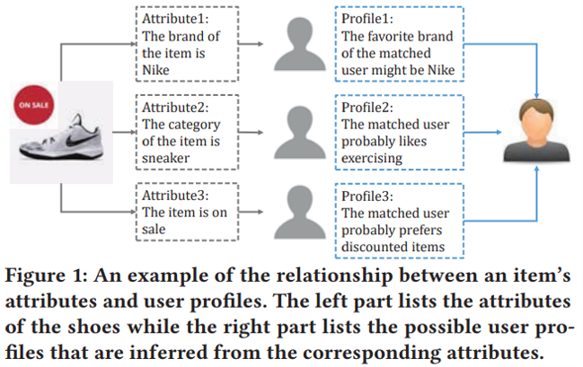
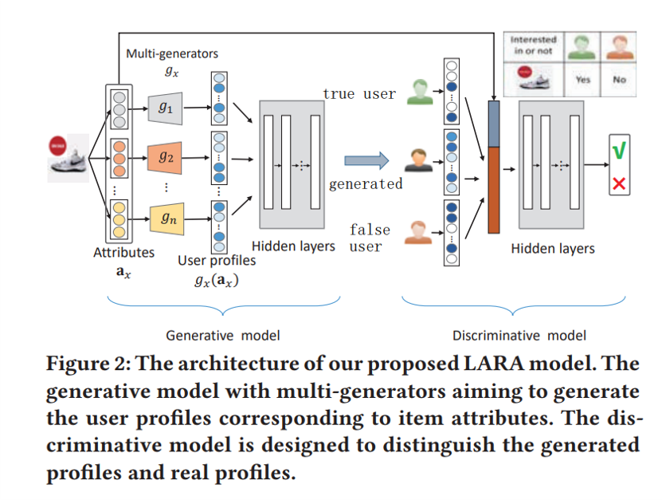

# the implementation of LARA: Attribute-to-feature Adversarial Learning for New-item Recommendation
<a href = "https://github.com/changfengsun/LARA. ">LARA论文链接</a> 
个性化推荐在许多在线应用中变得越来越重要，最近，一些深度学习模型用于提升推荐性能。然而，冷启动问题，严重地影响了推荐性能。使个性化推荐面临挑战。
冷启动：当一个新的item进入推荐系统时，因为缺乏user和item的历史交互数据，很难做推荐。
处理这类问题，我们认为item的属性是不可或缺的。因此，在新的item推荐场景中处理冷启动问题的关键，是在新的item和user之间建立一种关系。每个item有多个属性，每个属性通常反映一个真实世间中的特定的用户画像。因此，我们想要优化真实的用户与由item属性生成的用户之间的匹配问题。
 

论文设计了一个新颖的new item冷启动推荐系统，通过使用多个生成器，对item的不同属性进行联合建模表示出用户画像。
引入了一些技巧，来提升推荐系统的性能。为了避免稀疏性问题，引入了一种新的方法来表示用户。为了让生成的用户与真实用户尽可能的接近，而且让生成的用户与给定item匹配，我们引入了三种用户表示(true user, false user, generated user)。
构建了一个消费者在超市购买记录的数据集。

模型总体架构：  
  
模型由两部分组成，生成模型生成对给定item可能感兴趣的用户画像，判别器模型用来区分生成的用户画像与真实的用户画像。

在模型训练完成之后，给定一个新item的属性，生成模型可以生成新item属性级别的用户表示向量。然后，我们从所有用户集𝑈中选取N个与生成的用户最相似的用户来推荐。

使用余弦相似度来计算相似性。
 
 
参考博客：<a href = "https://blog.csdn.net/zuzhiang/article/details/105412789">LARA：基于GAN的解决冷启动问题的推荐系统</a> 

